This toy example shows how to model *heteroscedasticity in the latent
field and the noise*. It shows :

-   how to initialize the model
-   how to diagnose convergence
-   how to compare the models (with a stationary model) using DIC
-   how to do predictions

Generate synthetic data
-----------------------

    set.seed(1)
    # Generate locations
    locs = cbind(5*runif(3000), 5*runif(3000))
    #Generate latent fields for the parameters
    latent_field_noise =   GpGp::fast_Gp_sim(c(.5, 1, 1, 0), locs = locs)
    latent_field_scale =   GpGp::fast_Gp_sim(c(.5, 1, 1, 0), locs = locs)
    # set number of observations
    n_obs = 2 * nrow(locs)
    # observing with duplicates
    observation_idx = c(sample(nrow(locs), nrow(locs) , replace =F), sample(nrow(locs), n_obs - nrow(locs) , replace =T))
    observed_locs = locs[observation_idx,]
    # covariates
    X = as.data.frame(cbind(rbinom(n = n_obs, size = 1, prob = .5)))
    colnames(X) = c("binomial")
    X_noise = X
    # regression coeffs
    beta = c(100, 5)
    beta_noise = c(-.5, 1)
    # get logarithm of the parameters
    log_noise_variance = as.matrix(cbind(1, X_noise)) %*% beta_noise + latent_field_noise[observation_idx]
    log_scale = as.matrix(latent_field_scale[observation_idx])
    # Use NNGP to generate data
    NNarray = GpGp::find_ordered_nn(locs, 10) # Nearest Neighbor Array
    sparse_chol = Bidart::compute_sparse_chol(covfun_name = "exponential_isotropic", range_beta = log(.1), locs = locs, NNarray = NNarray) # stationary covariance
    # get latent NNGP field and observed Gaussian field
    latent_field = GpGp::fast_Gp_sim_Linv(Linv = sparse_chol[[1]], NNarray = NNarray)
    observed_field = as.vector(exp(.5*log_scale) * latent_field[observation_idx] +exp(.5*log_noise_variance)*rnorm(n_obs)+ cbind(1, as.matrix(X))%*%beta)

Let’s plot the latent field for the NNGP’s marginal variance…

    Bidart::plot_pointillist_painting(locs, latent_field_scale, main = "field for latent process log variance")

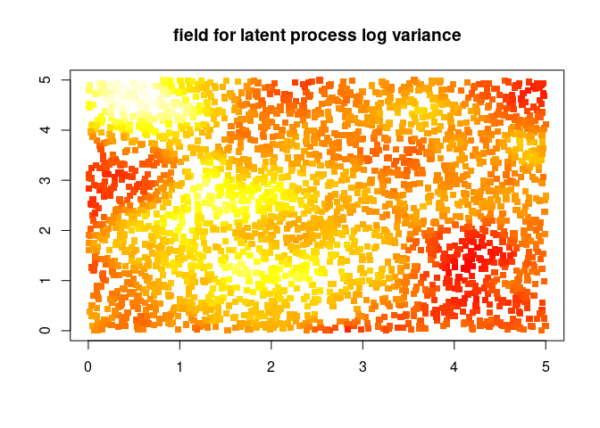

Let’s plot the latent field for the noise variance…

    Bidart::plot_pointillist_painting(locs, latent_field_noise, main = "field for noise log variance")

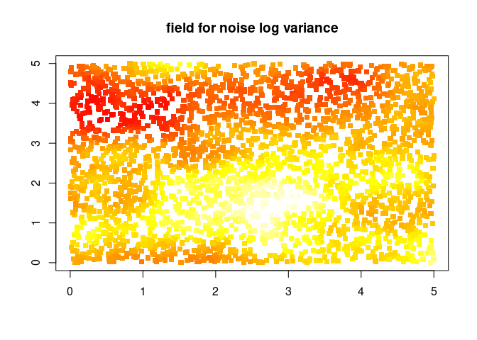

Let’s plot the latent field…

    Bidart::plot_pointillist_painting(locs, latent_field, main = "latent field")

Nonstationary model
-------------------

Initialize

    mcmc_nngp_list_nonstat = Bidart::mcmc_nngp_initialize_nonstationary (
      observed_locs = observed_locs, #spatial locations
      observed_field = c(observed_field), # Response variable
      X = X, # Covariates for the observed field
      m = 5, #number of Nearest Neighbors
      reordering = c("maxmin"), #Reordering
      covfun = "exponential_isotropic", response_model = "Gaussian", # covariance model and response model
      noise_X = X_noise, # covariates for the noise
      noise_range = .5, # range for latent field of parameters, if NULL no latent field
      scale_X = NULL, # covariates for the scale
      scale_range = .5, # range for latent field of parameters, if NULL no latent field
      log_NNGP_matern_covfun = "matern_isotropic", # covariance function for the hyperpriors
      log_NNGP_matern_smoothness = 1, # covariance function for the hyperpriors
      n_chains = 3,  # number of MCMC chains
      seed = 10
    )

    ## Setup done, 1.23707604408264 s elapsed

Run

    for(i in seq(40))
    {
      mcmc_nngp_list_nonstat = Bidart::mcmc_nngp_run_nonstationary(mcmc_nngp_list_nonstat, n_iterations_update = 100, n_cycles = 1)
    }

Check convergence

    Bidart::diagnostic_plots(mcmc_nngp_list_nonstat)

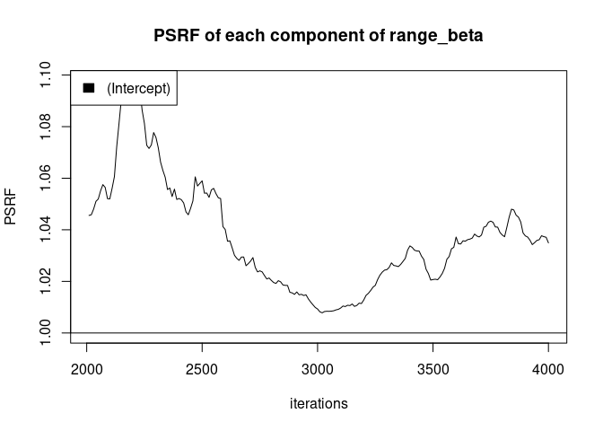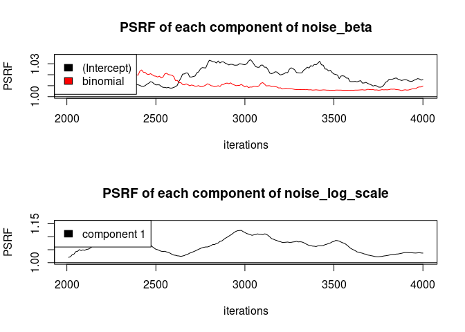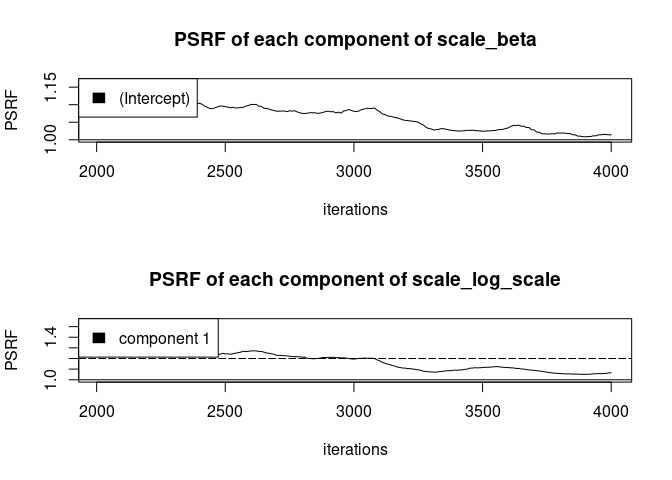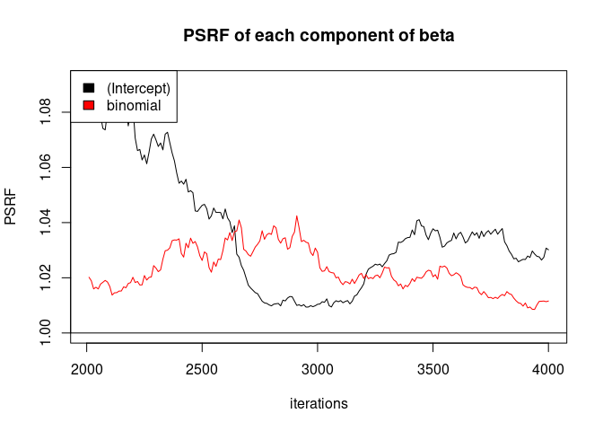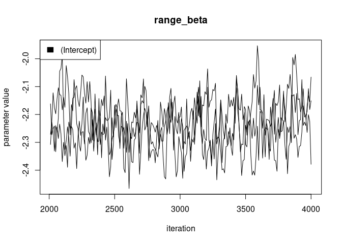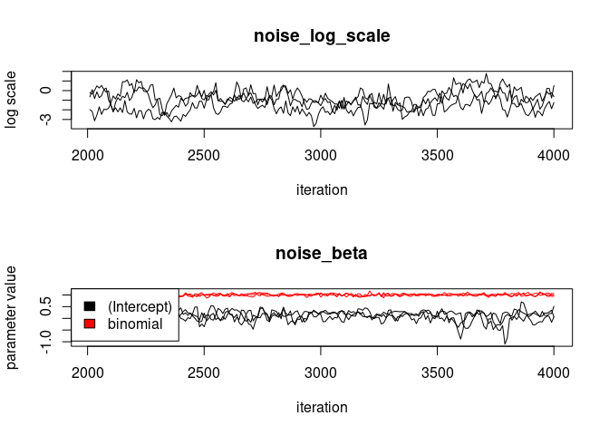

Stationary model
----------------

Initialize

    mcmc_nngp_list_stat = Bidart::mcmc_nngp_initialize_nonstationary (
      observed_locs = observed_locs, #spatial locations
      observed_field = c(observed_field), # Response variable
      X = X, # Covariates for the observed field
      m = 10, #number of Nearest Neighbors
      reordering = c("maxmin"), #Reordering
      covfun = "exponential_isotropic", response_model = "Gaussian", # covariance model and response model
      n_chains = 3,  # number of MCMC chains
      seed = 10
    )

    ## Setup done, 0.587935209274292 s elapsed

Run

    for(i in seq(40))
    {
      mcmc_nngp_list_stat = Bidart::mcmc_nngp_run_nonstationary(mcmc_nngp_list_stat, n_iterations_update = 100, n_cycles = 1)
    }

Check convergence

    Bidart::diagnostic_plots(mcmc_nngp_list_nonstat)

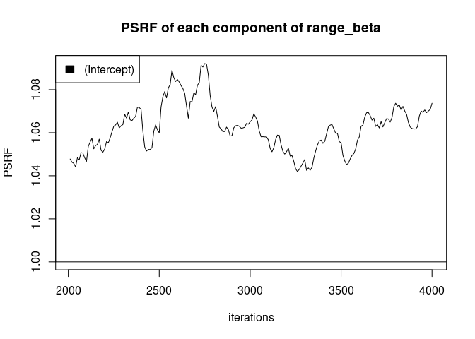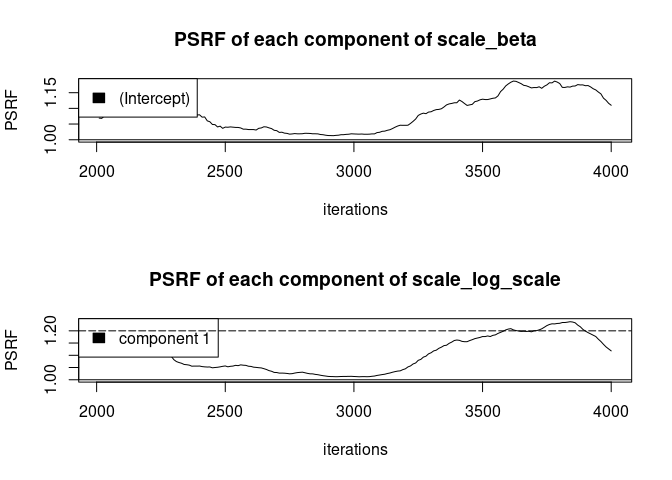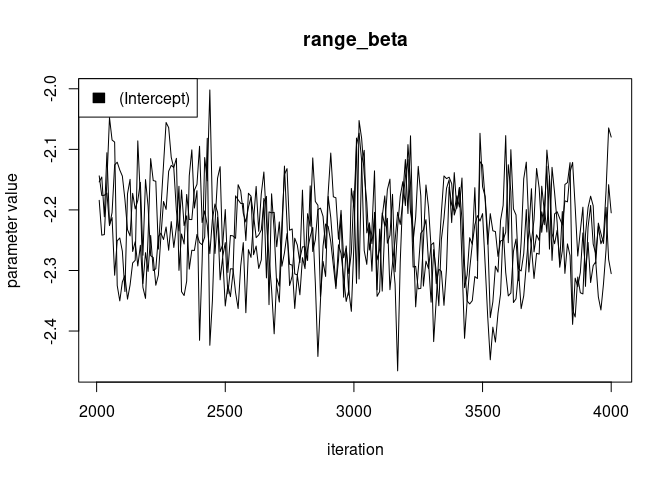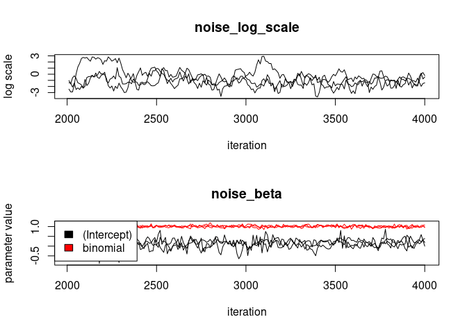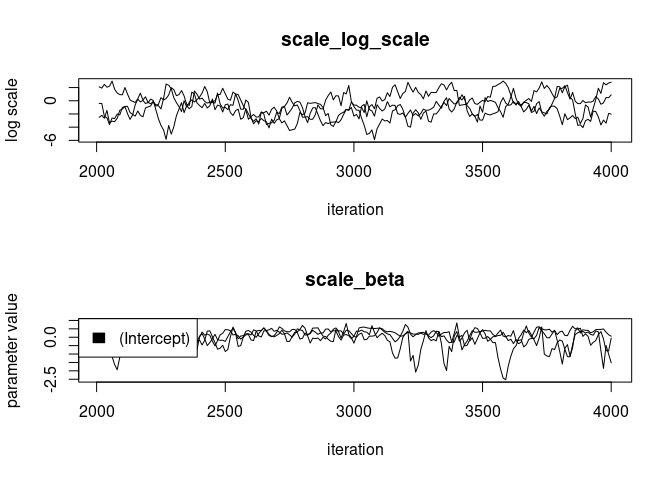

Model comparison
----------------

    print("DIC nonstat")

    ## [1] "DIC nonstat"

    print(Bidart::DIC(mcmc_nngp_list_nonstat))

    ## [1] 19769.07

    print("DIC stat")

    ## [1] "DIC stat"

    print(Bidart::DIC(mcmc_nngp_list_stat))

    ## [1] 21710.68

Prediction
----------

    predicted_locs = as.matrix(expand.grid(seq(0, 5, .1), seq(0, 5, .1)))
    pred = Bidart::predict_latent_field(mcmc_nngp_list = mcmc_nngp_list_nonstat, predicted_locs = predicted_locs)

    par(mfrow = c(1, 1))
    Bidart::plot_pointillist_painting(pred$predicted_locs, pred$summaries$field[1,], cex = 1.8, main = "predicted mean")

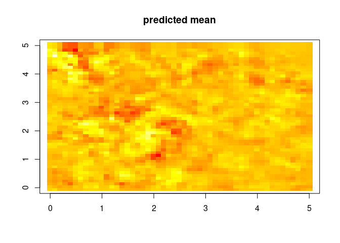

    Bidart::plot_pointillist_painting(pred$predicted_locs, pred$summaries$field[5,], cex = 1.8, main = "standard deviation of the prediction")

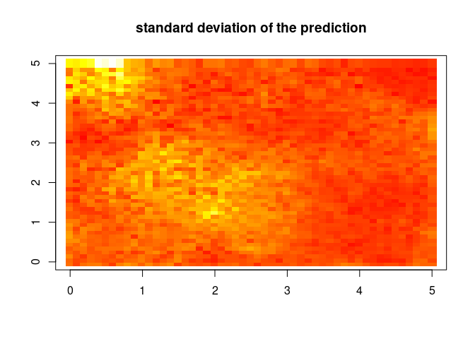

    Bidart::plot_pointillist_painting(pred$predicted_locs, pred$summaries$scale_field[1,], cex = 1.8, main = "latent scale field")

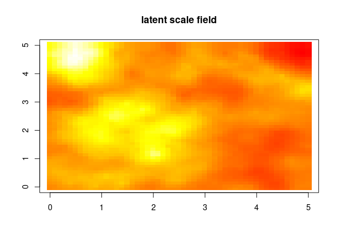
