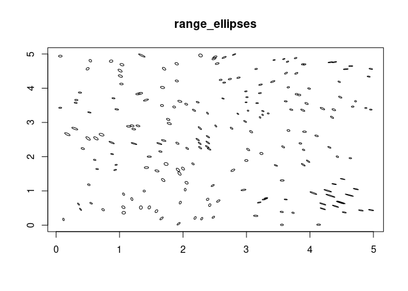
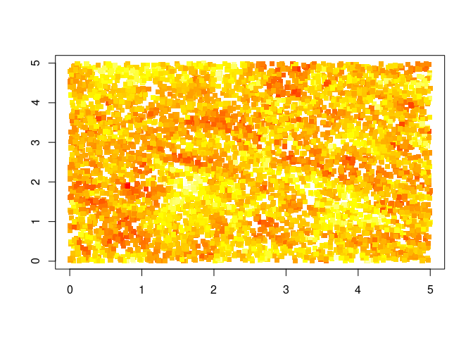
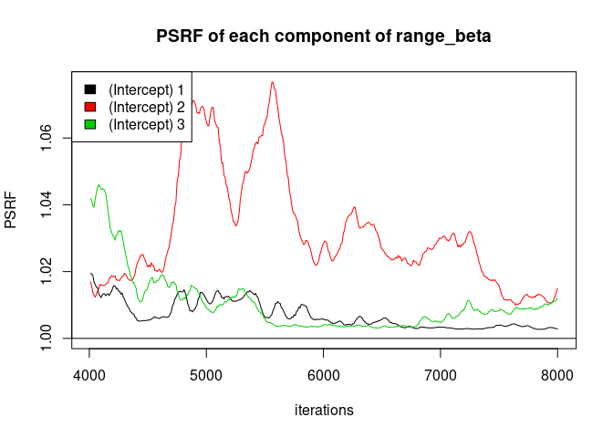
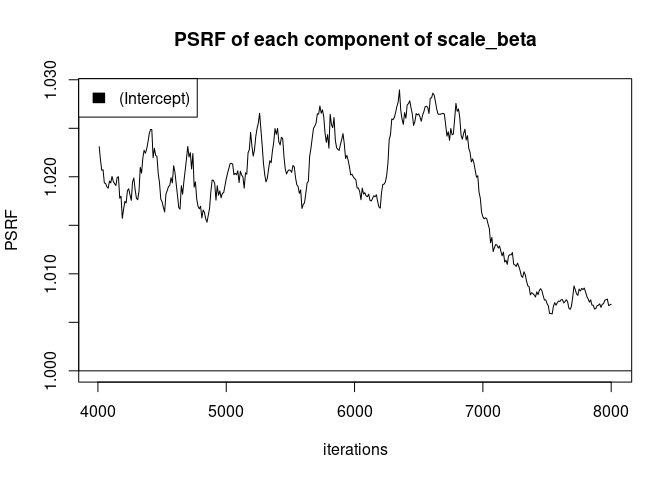
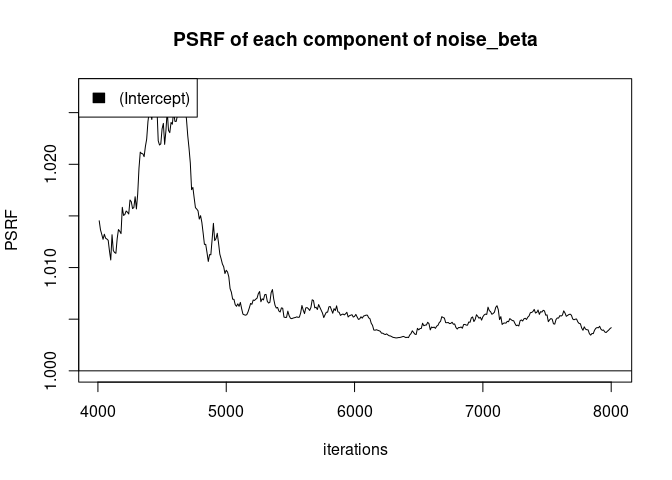
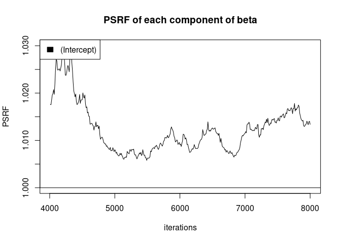
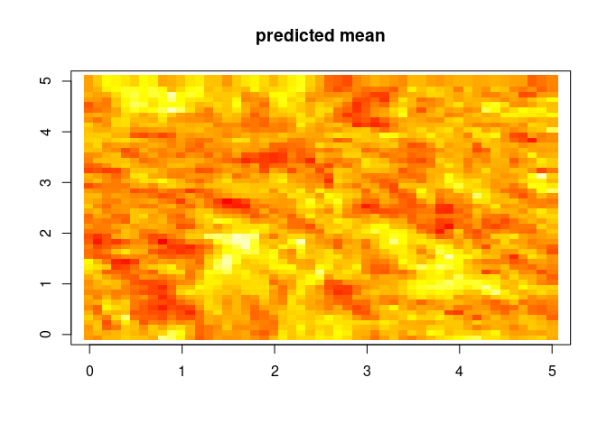
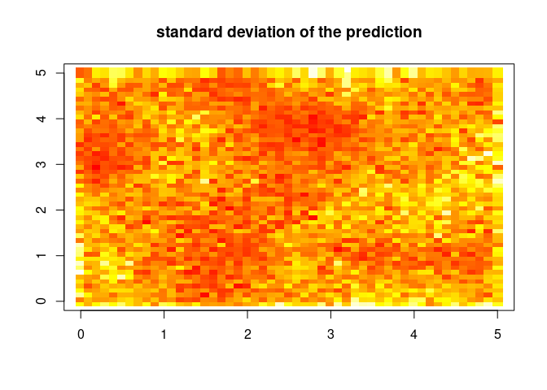
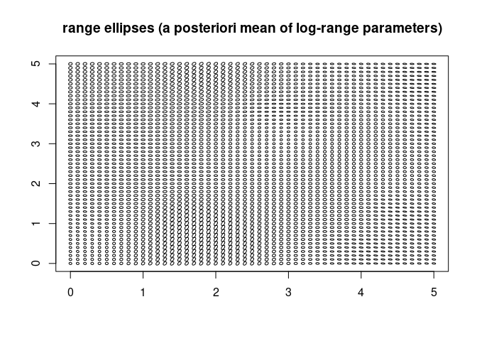

This toy example shows how to model *locally anisotropic range*. It
shows :

-   how to initialize the model
-   how to diagnose convergence
-   how to compare the models (with a stationary model) using DIC
-   how to do predictions

Generate synthetic data
-----------------------

    set.seed(1)  
    # locations and latent fields
    locs = 5 * matrix(runif(20000), ncol = 2)
    locs = locs[GpGp::order_maxmin(locs),]
    latent_field_range = cbind(
      GpGp::fast_Gp_sim(c(.5, .5, 1, 0), locs = locs),
      GpGp::fast_Gp_sim(c(.5, .5, 1, 0), locs = locs),
      GpGp::fast_Gp_sim(c(.5, .5, 1, 0), locs = locs))
    latent_field_range = latent_field_range %*% matrix(c(1/sqrt(2), 1/sqrt(2), 0, 1/sqrt(2), -1/sqrt(2), 0, 0, 0, 1), 3)

    range_beta = c(log(.1)/sqrt(2), log(.1)/sqrt(2), 0)
      
    # observing observations, with duplicates
    n_obs = 20000
    observation_idx = c(sample(10000, 10000 , replace =F), sample(10000, n_obs - 10000 , replace =T))
    observed_locs = locs[observation_idx,]
      
    # computing sparse chol
    NNarray = GpGp::find_ordered_nn(locs, 5)
    sparse_chol = Bidart::compute_sparse_chol(covfun_name = "nonstationary_exponential_anisotropic", range_beta = range_beta, locs = locs, NNarray = NNarray, range_field =  latent_field_range, range_X = matrix(rep(1, nrow(locs))))
      
    # latent field
    latent_field = GpGp::fast_Gp_sim_Linv(Linv = sparse_chol[[1]], NNarray = NNarray)
    # observed field
    observed_field = as.vector(latent_field[observation_idx] + rnorm(n_obs)* exp(.5 * log(.5))) 

Let’s plot the latent field for the NNGP’s range…

    Bidart::plot_ellipses(locs[seq(200),], latent_field_range[seq(200),], shrink = .01, main = "range_ellipses")

Let’s plot the latent field…

    Bidart::plot_pointillist_painting(locs, latent_field)

Nonstationary model
-------------------

Initialize

    mcmc_nngp_list_range = Bidart::mcmc_nngp_initialize_nonstationary (
      observed_locs = observed_locs, #spatial locations
      observed_field = c(observed_field), # Response variable
      m = 5, #number of Nearest Neighbors
      reordering = c("maxmin"), #Reordering
      covfun = "nonstationary_exponential_anisotropic", response_model = "Gaussian", # covariance model and response model
      range_range = .5, 
      log_NNGP_matern_covfun = "matern_isotropic", # covariance function for the hyperpriors
      log_NNGP_matern_smoothness = 1, # covariance function for the hyperpriors
      n_chains = 3,  # number of MCMC chains
      seed = 10
    )

    ## Setup done, 3.68718981742859 s elapsed

Run

    for(i in seq(80))
    {
      mcmc_nngp_list_range = Bidart::mcmc_nngp_run_nonstationary(mcmc_nngp_list_range, n_iterations_update = 100, n_cycles = 1)
    }

Check convergence. (Normally diagnostics pop automatically or are all
generated using diagnostic\_plots() and look great in Rstudio, but in
order to get decent pictures in the md lower functions are called)

    # normally one should use diagnostic_plots()  , but in order to get good pictures lower functions are used
    name = "range_log_scale"
    Bidart::plot_PSRF(PSRF = Bidart::grb_diags_field(record_arrays = lapply(mcmc_nngp_list_range$records, function(x)x[[name]]), iterations = mcmc_nngp_list_range$iterations$thinning), varname = name, individual_varnames = row.names(mcmc_nngp_list_range$states$chain_1$params[[name]]))

    # normally one should use diagnostic_plots()  , but in order to get good pictures lower functions are used
    name = "range_beta"
    Bidart::plot_PSRF(PSRF = Bidart::grb_diags_field(record_arrays = lapply(mcmc_nngp_list_range$records, function(x)x[[name]]), iterations = mcmc_nngp_list_range$iterations$thinning), varname = name, individual_varnames = row.names(mcmc_nngp_list_range$states$chain_1$params[[name]]))

    # normally one should use diagnostic_plots()  , but in order to get good pictures lower functions are used
    name = "scale_beta"
    Bidart::plot_PSRF(PSRF = Bidart::grb_diags_field(record_arrays = lapply(mcmc_nngp_list_range$records, function(x)x[[name]]), iterations = mcmc_nngp_list_range$iterations$thinning), varname = name, individual_varnames = row.names(mcmc_nngp_list_range$states$chain_1$params[[name]]))

    # normally one should use diagnostic_plots()  , but in order to get good pictures lower functions are used
    name = "noise_beta"
    Bidart::plot_PSRF(PSRF = Bidart::grb_diags_field(record_arrays = lapply(mcmc_nngp_list_range$records, function(x)x[[name]]), iterations = mcmc_nngp_list_range$iterations$thinning), varname = name, individual_varnames = row.names(mcmc_nngp_list_range$states$chain_1$params[[name]]))

    # normally one should use diagnostic_plots()  , but in order to get good pictures lower functions are used
    name = "beta"
    Bidart::plot_PSRF(PSRF = Bidart::grb_diags_field(record_arrays = lapply(mcmc_nngp_list_range$records, function(x)x[[name]]), iterations = mcmc_nngp_list_range$iterations$thinning), varname = name, individual_varnames = row.names(mcmc_nngp_list_range$states$chain_1$params[[name]]))

Stationary model
----------------

Initialize

    mcmc_nngp_list_stat = Bidart::mcmc_nngp_initialize_nonstationary (
      observed_locs = observed_locs, #spatial locations
      observed_field = c(observed_field), # Response variable
      m = 5, #number of Nearest Neighbors
      reordering = c("maxmin"), #Reordering
      covfun = "exponential_isotropic", response_model = "Gaussian", # covariance model and response model
      n_chains = 3,  # number of MCMC chains
      seed = 10
    )

    ## Setup done, 1.01590991020203 s elapsed

Run

    for(i in seq(40))
    {
      mcmc_nngp_list_stat = Bidart::mcmc_nngp_run_nonstationary(mcmc_nngp_list_stat, n_iterations_update = 100, n_cycles = 1)
    }

Convergence is checked using diagnostic\_plots()

Model comparison
----------------

    print(Bidart::DIC(mcmc_nngp_list_range))

    ## [1] 47429.92

    print(Bidart::DIC(mcmc_nngp_list_stat))

    ## [1] 47598.2

Prediction
----------

    predicted_locs = as.matrix(expand.grid(seq(0, 5, .1), seq(0, 5, .1)))
    pred = Bidart::predict_latent_field(mcmc_nngp_list = mcmc_nngp_list_range, predicted_locs = predicted_locs)

    par(mfrow = c(1, 1))
    Bidart::plot_pointillist_painting(pred$predicted_locs, pred$summaries$field[1,], cex = 1.8, main = "predicted mean")

    Bidart::plot_pointillist_painting(pred$predicted_locs, pred$summaries$field[5,], cex = 1.8, main = "standard deviation of the prediction")

    Bidart::plot_ellipses(pred$predicted_locs, log_range = pred$summaries$range_field[1,,], shrink = .01, main = "range ellipses (a posteriori mean of log-range parameters)")

