This toy example shows how to model *locally isotropic range*. It shows
:

-   how to initialize the model
-   how to diagnose convergence
-   how to compare the models (with a stationary model) using DIC
-   how to detect over-modelling with a locally anisotropic range, or
    with locally isotropic range and nonstationary variance
-   how to do predictions

Generate synthetic data
-----------------------

    set.seed(1)
    # Generate locations
    locs = cbind(5*runif(3000), 5*runif(3000))
    #Generate latent fields for the parameters
    latent_field_range =   GpGp::fast_Gp_sim(c(.5, 1, 1, 0), locs = locs)
    # set number of observations
    n_obs = 2 * nrow(locs)
    # observing with duplicates
    observation_idx = c(sample(nrow(locs), nrow(locs) , replace =F), sample(nrow(locs), n_obs - nrow(locs) , replace =T))
    observed_locs = locs[observation_idx,]
    # covariates
    X = as.data.frame(cbind(rbinom(n = n_obs, size = 1, prob = .5)))
    colnames(X) = c("binomial")
    # regression coeffs
    beta = c(100, 5)
    beta_noise = c(-.5, 1)
    # Use NNGP to generate data
    NNarray = GpGp::find_ordered_nn(locs, 10) # Nearest Neighbor Array
    sparse_chol = Bidart::compute_sparse_chol(covfun_name = "nonstationary_exponential_isotropic", range_beta = log(.1), locs = locs, NNarray = NNarray, range_field =  latent_field_range, range_X = as.matrix(rep(1, nrow(locs)))) # stationary covariance
    # get latent NNGP field and observed Gaussian field
    latent_field = GpGp::fast_Gp_sim_Linv(Linv = sparse_chol[[1]], NNarray = NNarray)
    observed_field =  as.vector(latent_field[observation_idx] +rnorm(n_obs)+ cbind(1, as.matrix(X))%*%beta)

Let’s plot the latent field for the NNGP’s range…

    Bidart::plot_pointillist_painting(locs, latent_field_range)

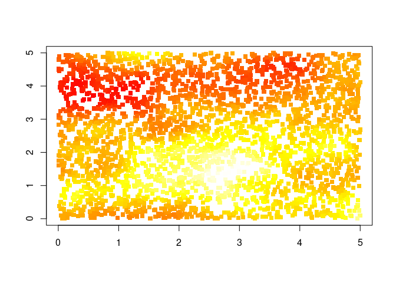

Let’s plot the latent field…

    Bidart::plot_pointillist_painting(locs, latent_field)

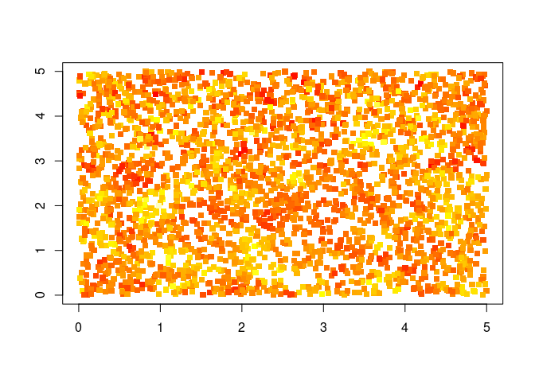

Nonstationary model
-------------------

Initialize

    mcmc_nngp_list_range = Bidart::mcmc_nngp_initialize_nonstationary (
      observed_locs = observed_locs, #spatial locations
      observed_field = c(observed_field), # Response variable
      X = X, # Covariates for the observed field
      m = 5, #number of Nearest Neighbors
      reordering = c("maxmin"), #Reordering
      covfun = "nonstationary_exponential_isotropic", response_model = "Gaussian", # covariance model and response model
      range_range = .5, 
      log_NNGP_matern_covfun = "matern_isotropic", # covariance function for the hyperpriors
      log_NNGP_matern_smoothness = 1, # covariance function for the hyperpriors
      n_chains = 3,  # number of MCMC chains
      seed = 10
    )

    ## Setup done, 1.505619764328 s elapsed

Run

    for(i in seq(40))
    {
      mcmc_nngp_list_range = Bidart::mcmc_nngp_run_nonstationary(mcmc_nngp_list_range, n_iterations_update = 100, n_cycles = 1)
    }

Check convergence, look at the Gelman-Rubin-Broks diagnostics

    Bidart::diagnostic_plots(mcmc_nngp_list_range)

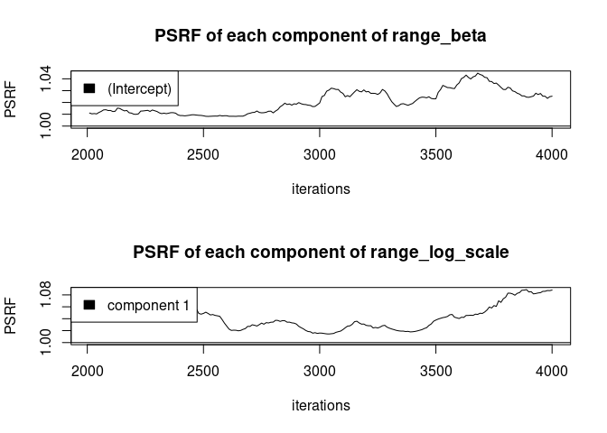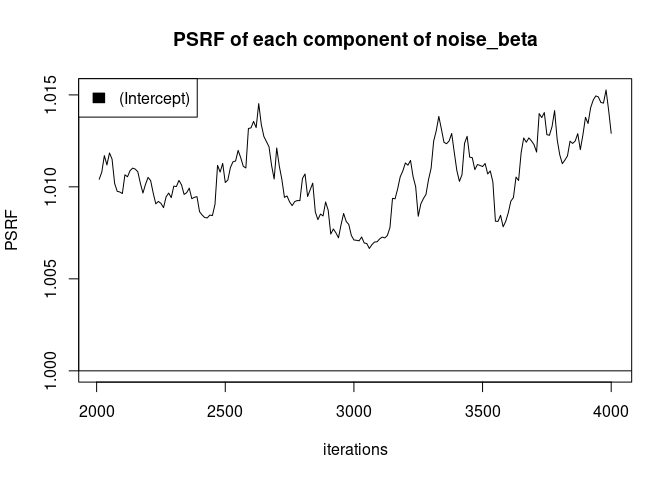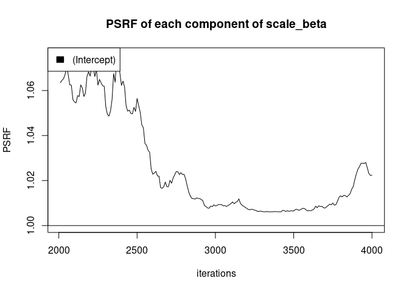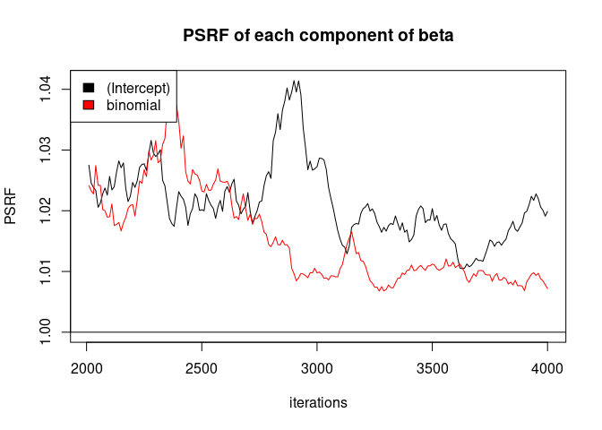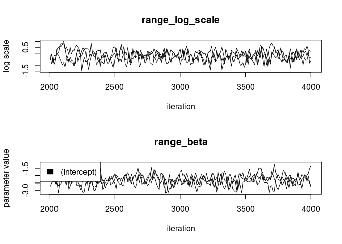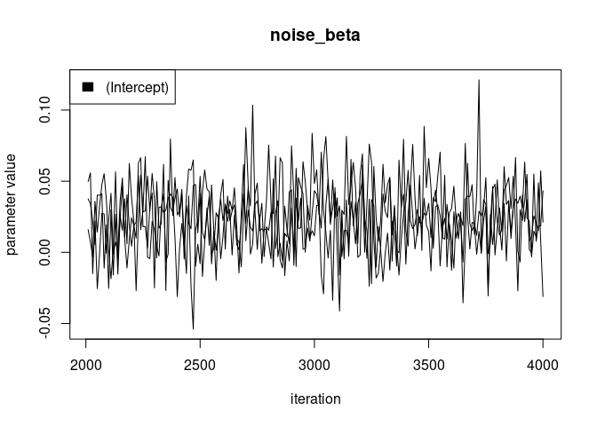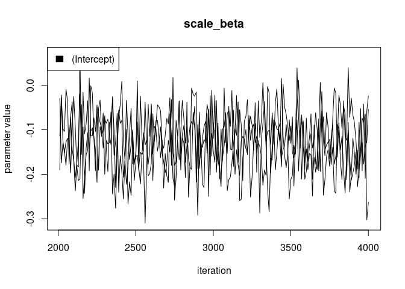

Stationary model
----------------

Initialize

    mcmc_nngp_list_stat = Bidart::mcmc_nngp_initialize_nonstationary (
      observed_locs = observed_locs, #spatial locations
      observed_field = c(observed_field), # Response variable
      X = X, # Covariates for the observed field
      m = 5, #number of Nearest Neighbors
      reordering = c("maxmin"), #Reordering
      covfun = "exponential_isotropic", response_model = "Gaussian", # covariance model and response model
      n_chains = 3,  # number of MCMC chains
      seed = 10
    )

    ## Setup done, 0.51277232170105 s elapsed

Run

    for(i in seq(40))
    {
      mcmc_nngp_list_stat = Bidart::mcmc_nngp_run_nonstationary(mcmc_nngp_list_stat, n_iterations_update = 100, n_cycles = 1)
    }

Convergence is checked with diagnostic\_plots() like before.

Nonstationary elliptic model (over-modelling)
---------------------------------------------

Initialize

    mcmc_nngp_list_range_ell = Bidart::mcmc_nngp_initialize_nonstationary (
      observed_locs = observed_locs, #spatial locations
      observed_field = c(observed_field), # Response variable
      X = X, # Covariates for the observed field
      m = 5, #number of Nearest Neighbors
      reordering = c("maxmin"), #Reordering
      covfun = "nonstationary_exponential_anisotropic", response_model = "Gaussian", # covariance model and response model
      range_range = .5, 
      log_NNGP_matern_covfun = "matern_isotropic", # covariance function for the hyperpriors
      log_NNGP_matern_smoothness = 1, # covariance function for the hyperpriors
      n_chains = 3,  # number of MCMC chains
      seed = 10
    )

    ## Setup done, 0.872808933258057 s elapsed

Run

    for(i in seq(4))
    {
      mcmc_nngp_list_range_ell = Bidart::mcmc_nngp_run_nonstationary(mcmc_nngp_list_range_ell, n_iterations_update = 100, n_cycles = 1)
    }

Lo and behold, the two \`\`anisotropy" components are low ! (normally
this pops up automatically)

    Bidart::plot_log_scale(log_scale_arrays =
                             list(
                               mcmc_nngp_list_range_ell$records$chain_1$range_log_scale,
                               mcmc_nngp_list_range_ell$records$chain_2$range_log_scale,
                               mcmc_nngp_list_range_ell$records$chain_3$range_log_scale
                                  ), 
                           iterations = mcmc_nngp_list_range_ell$iterations$thinning, 
                           starting_proportion = 0, 
                           varname = "range_log_scale"
                           )

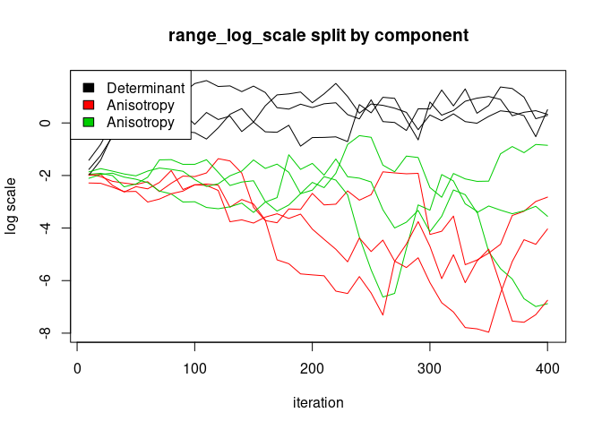

Nonstationary model with range and scale (over modelling)
---------------------------------------------------------

Initialize

    mcmc_nngp_list_range_scale = Bidart::mcmc_nngp_initialize_nonstationary (
      observed_locs = observed_locs, #spatial locations
      observed_field = c(observed_field), # Response variable
      X = X, # Covariates for the observed field
      m = 5, #number of Nearest Neighbors
      reordering = c("maxmin"), #Reordering
      covfun = "nonstationary_exponential_isotropic", response_model = "Gaussian", # covariance model and response model
      range_range = .5, 
      scale_range = .5, 
      log_NNGP_matern_covfun = "matern_isotropic", # covariance function for the hyperpriors
      log_NNGP_matern_smoothness = 1, # covariance function for the hyperpriors
      n_chains = 3,  # number of MCMC chains
      seed = 10
    )

    ## Setup done, 0.586896419525146 s elapsed

Run

    for(i in seq(4))
    {
      mcmc_nngp_list_range_scale = Bidart::mcmc_nngp_run_nonstationary(mcmc_nngp_list_range_scale, n_iterations_update = 100, n_cycles = 1)
    }

Lo and behold, the marginal variance’s log scale is low ! (those plots
pop up automatically)

    Bidart::plot_log_scale(log_scale_arrays =
                             list(
                               mcmc_nngp_list_range_scale$records$chain_1$scale_log_scale,
                               mcmc_nngp_list_range_scale$records$chain_2$scale_log_scale,
                               mcmc_nngp_list_range_scale$records$chain_3$scale_log_scale
                                  ), 
                           iterations = mcmc_nngp_list_range_scale$iterations$thinning, 
                           starting_proportion = 0, 
                           varname = "scale_log_scale"
                           )

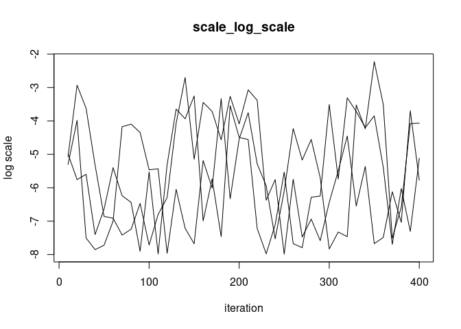

Model comparison
----------------

    print(Bidart::DIC(mcmc_nngp_list_range))

    ## [1] 18530.65

    print(Bidart::DIC(mcmc_nngp_list_stat))

    ## [1] 18621

Prediction
----------

    predicted_locs = as.matrix(expand.grid(seq(0, 5, .1), seq(0, 5, .1)))
    pred = Bidart::predict_latent_field(mcmc_nngp_list = mcmc_nngp_list_range, predicted_locs = predicted_locs)

    par(mfrow = c(1, 1))
    Bidart::plot_pointillist_painting(pred$predicted_locs, pred$summaries$field[1,,], cex = 1.8, main = "predicted mean")

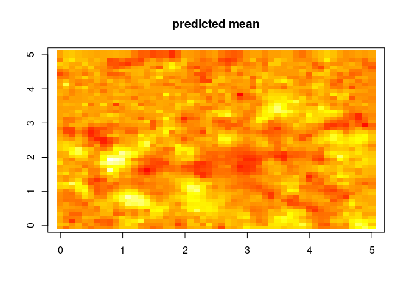

    Bidart::plot_pointillist_painting(pred$predicted_locs, pred$summaries$field[5,,], cex = 1.8, main = "standard deviation of the prediction")

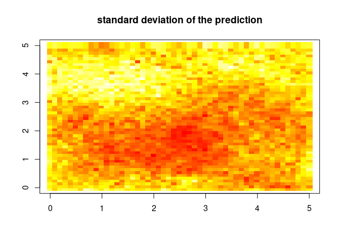

    Bidart::plot_pointillist_painting(pred$predicted_locs, pred$summaries$range_field[1,,], cex = 1.8, main = "latent range field")

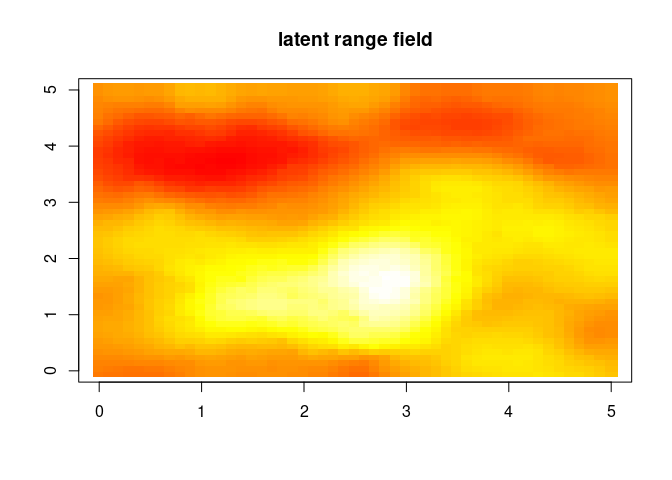
